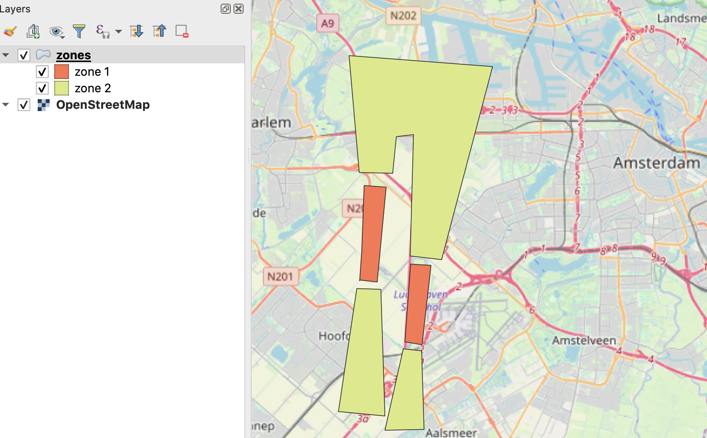

# Voorbeeldbestand van GIO met GIO-delen

Deze map bevat een voorbeeld van een GIO met delen. Het bestand met
[GIO-delen.gml](GIO-delen.gml) is een GML bestand met vijf locaties verdeeld over twee GIO-delen, te weten
'zone 1' en 'zone 2'. Deze delen hebben als identificatie 'zone1' en 'zone'.

